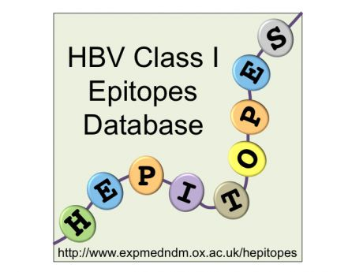

# Hepitopes

</img>

Hepitopes is a project to collate all the existing HBV epitopes restricted by HLA Class I genes, and to develop this into a live on-line resource that can grow and develop over time.
 
The initial stage of this work has been to perform a literature search to identify all epitopes that have been published to date. We have undertaken a detailed review of all the references such that we can list epitope HLA-restrictions, locations in the HBV proteome, sequences and polymorphisms, and report preliminary data regarding the potential clinical significance of epitope-specific T cell immune responses.
 
Over time, this database will continue to be updated such that we can develop and maintain an open-access resource that is useful for basic research and clinical vaccine design. This will include new epitopes identified as a result of my own work in Hepatitis B immunogenetics, as well as continuing to identify and collate new epitopes published by other groups.

# Data and License Details

|       |            |
| ------------- |:-------------|
| Authors:      | [Philippa Matthews](http://orcid.org/0000-0002-4036-4269) (Academic)   [Martin Hadley](orcid.org/0000-0002-3039-6849) (Developer) |
| Data: | https://dx.doi.org/10.6084/m9.figshare.4015824 (Live Data)   https://dx.doi.org/10.5287/bodleian:zr0VAr78q (Deposit at time of publication) |
| Live Visualisation:      | www.expmedndm.ox.ac.uk/hepitopes |
| Citing works: | Lumley S, Noble H, Hadley M et al. Hepitopes: literature review and database of HLA Class I epitopes in Hepatitis B Virus (HBV) [v1; not peer reviewed]. F1000Research 2016, 5:2357 (poster) (doi: [10.7490/f1000research.1113165.1](http://dx.doi.org/10.7490/f1000research.1113165.1) |
| License: | MIT |
| Copyright: | University of Oxford, 2016 |

